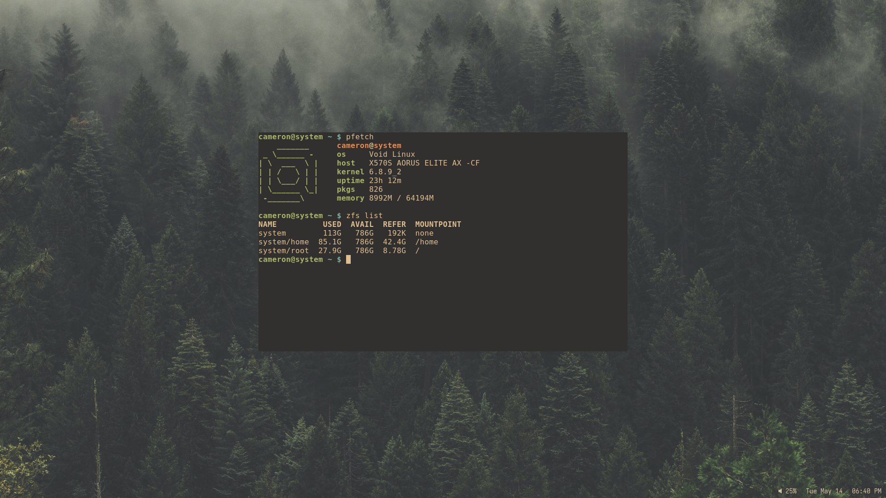

# Void



Many of these notes are just for reference.

## Hardware

### Desktop

* Ryzen 9 5900x
* PowerColor 6650 XT
* Aorus x570s Elite AX ([settings](#bios))
* 2 x 32 GB ECC (https://www.kingston.com/dataSheets/KSM32ED8_32ME.pdf)
* 3 x Samsung 970 Evo Plus

### Laptop

* HP Dev One
* Intel AX200 Wi-Fi 6
* Samsung 990 Evo

### Peripherals

* Razer Naga Chroma
* [8BitDo Pro 2](https://www.8bitdo.com/pro2/)

### ZFS Topology

```
system/root
system/home
```

### Hardware Topology

2 x NVMe -> ZFS mirror

1 x NVMe -> Fat32 boot (ZFSBootMenu)

### BIOS

* Tweaker -> Advanced CPU Settings -> SVM Mode: Enabled
* Settings -> Miscellaneous -> LEDs in System Power On State: Off
* Boot -> Full Screen LOGO Show: Disabled
* Boot -> Fast Boot: Disabled
* Boot -> CSM Support: Disabled
* Boot -> Secure Boot -> Secure Boot: Disabled
* Boot -> Preferred Operating Mode: Advanced Mode
* Smart Fan 6 (F6): 30:*20C*, 32:*30C*, 34:*40C*, 36:*50C*, 38:*60C*, 40:*70C*, 80:*85C*
* Favorites (F11): Press 'Insert' key until favorite list has been cleared

<!-- Make sure to use step instead of gradual when adjusting the fan curve.
That way the fan only kicks in at 85C. -->

<!-- *Note: The only way to make persistent changes to the fan curve is by dragging with the mouse.
Manually entering numbers into the text boxes below does not work.* -->

### EFI

```
BootCurrent: 0000
Timeout: 0 seconds
BootOrder: 0000,0001
Boot0000* ZFSBootMenu
Boot0001* ZFSBootMenu (Backup)
```

### Memory

```
dmidecode -t memory | grep "Total Width"
```

`72 bits` means ECC is working.

<!-- dmesg | grep EDAC -->

### Test

https://www.mersenne.org/download/

## Install

Desktop:

```
install.txt
```

Laptop:

```
install-laptop.txt
```

## Post

<!-- https://notabug.org/Marcoapc/voidxanmodK -->

### Laptop

<!-- ```
xbps-install -yu fwupd
fwupdtool refresh
fwupdtool get-updates
fwupdtool update
``` -->

*Note: Many applications can be zoomed in using `CTRL +`*

```
~/.config/alacritty/alacritty.toml : 16
~/.config/waybar/config            : 40 # height
~/.config/waybar/style.css         : 18
~/.config/waybar/style.css         : margin: 0 5px; # spacing
~/.config/wofi/style.css           : 18
~/.config/mako/config              : 14

about:config                       : layout.css.devPixelsPerPx = 1.25 # firefox
```

Consider bumping up scale instead:

```
output eDP-1 scale 1.25
```

Uncomment laptop related keybindings:

```
~/.config/sway/config
```

<!-- wpctl set-mute @DEFAULT_AUDIO_SOURCE@ 1 -->

### Wayland

<!-- https://github.com/swaywm/sway/wiki/VRR-setups -->

<!-- https://github.com/Alexays/Waybar/issues/1351#issuecomment-1001559391 -->

<!-- https://github.com/void-linux/void-packages?tab=readme-ov-file#quick-start -->

#### Spotify

```
xbps-install -Syu spotify-adblock

cp -f /usr/share/applications/spotify.desktop ~/.local/share/applications/

desktop-file-edit \
  --set-key=Exec \
  --set-value="env LD_PRELOAD=/usr/lib/spotify-adblock.so /usr/libexec/spotify/spotify --enable-features=UseOzonePlatform --ozone-platform=wayland %U" \
  ~/.local/share/applications/spotify.desktop

touch ~/.local/share/applications/spotify-adblock.desktop
```

#### Discord

```
cp -f /usr/share/applications/discord.desktop ~/.local/share/applications/

desktop-file-edit \
  --set-key=Exec \
  --set-value="/usr/lib/discord/Discord --enable-features=UseOzonePlatform --ozone-platform=wayland" \
  ~/.local/share/applications/discord.desktop
```

#### Code

```
cp -f /usr/share/applications/code-oss.desktop ~/.local/share/applications/

desktop-file-edit \
  --set-key=Exec \
  --set-value="/usr/lib/code-oss/bin/code-oss --enable-features=UseOzonePlatform --ozone-platform=wayland --unity-launch %F" \
  ~/.local/share/applications/code-oss.desktop
```

#### Chromium

```
sed "s|/usr/bin/chromium|/usr/bin/chromium --enable-features=UseOzonePlatform --ozone-platform=wayland|g" \
  /usr/share/applications/chromium.desktop > ~/.local/share/applications/chromium.desktop
```

#### Font

```
msttcorefonts
```

### Firefox

#### firefox-overlay

```
git clone https://gitlab.com/camj/firefox-overlay
cd firefox-overlay
make
make install
rsync -aAX init/runit/ ~/.sv/
```

#### Config

`about:config`:

```
browser.sessionstore.resume_from_crash = false
browser.tabs.tabmanager.enabled = false

gfx.webrender.all = true
media.ffmpeg.vaapi.enabled = true

mousewheel.default.delta_multiplier_y = 80

privacy.firstparty.isolate = true

toolkit.legacyUserProfileCustomizations.stylesheets = true
toolkit.tabbox.switchByScrolling = true
```

<!-- /home/cameron/.mozilla/firefox/<profile>/chrome/userChrome.css -->

`userChrome.css`:

```
:root[tabsintitlebar] #titlebar:-moz-window-inactive {
  opacity: 1 !important;
}

.titlebar-spacer[type="pre-tabs"] {
  display: none;
}

* {
  border-radius: 0 !important;
}
```

#### Extensions

<!-- * CanvasBlocker -->
<!-- * LocalCDN -->
* ClearURLs
* Dark Reader
* I don't care about cookies
* Privacy Badger
* Return YouTube Dislike
* SponsorBlock for YouTube - Skip Sponsorships
* h264ify
* uBlock Origin

### Thunar

```
touch ~/.local/share/applications/thunar-bulk-rename.desktop
touch ~/.local/share/applications/thunar-settings.desktop
```

`~/.config/user-dirs.dirs`:

```
XDG_DOCUMENTS_DIR="$HOME/Documents"
XDG_DOWNLOAD_DIR="$HOME/Downloads"
XDG_MUSIC_DIR="$HOME/Music"
XDG_PICTURES_DIR="$HOME/Pictures"
XDG_VIDEOS_DIR="$HOME/Videos"
```

*Note: Manually bookmark directories to make them appear on sidebar.*

### Theme

https://github.com/sainnhe/gruvbox-material

#### GTK

https://github.com/TheGreatMcPain/gruvbox-material-gtk

```
gsettings set org.gnome.desktop.interface gtk-theme Gruvbox-Material-Dark
gsettings set org.gnome.desktop.interface icon-theme Gruvbox-Material-Dark
```

#### Cursor

<!-- https://github.com/sainnhe/capitaine-cursors -->

```
gsettings set org.gnome.desktop.interface cursor-theme Adwaita
```

#### Recent

```
gsettings set org.gnome.desktop.privacy remember-recent-files false
```

#### Default

<!-- xdg-mime query filetype <file> -->

```
xdg-settings set default-web-browser firefox.desktop

xdg-mime default vlc.desktop video/video/mp4
xdg-mime default vlc.desktop video/x-matroska

xdg-mime default vlc.desktop audio/mpeg
xdg-mime default vlc.desktop audio/x-wav

xdg-mime default org.gnome.eog.desktop image/png
xdg-mime default org.gnome.eog.desktop image/jpeg

xdg-mime default org.gnome.eog.desktop image/gif
xdg-mime default org.gnome.eog.desktop image/webp
```

### WI-FI

<!-- iw dev wlan0 get power_save -->

`/var/lib/iwd/<ssid>.psk`:

```
[Security]
Passphrase=<password>
```

### Wireguard

Add peers to `/etc/wireguard`.

#### DNS

`/etc/resolv.conf`

### Bluetooth

https://wiki.archlinux.org/title/Bluetooth

```
scan on
devices
pair <dev>
trust <dev>
connect <dev>
scan off
```

### Printer

https://wiki.archlinux.org/title/CUPS

https://wiki.archlinux.org/title/SANE

https://www.pwg.org/printers/

#### Install

Main:

```
xbps-install -Syu \
  cups \
  cups-filters \
  system-config-printer \
  simple-scan
```

Drivers:

```
xbps-install -yu \
  brother-brlaser \
  cnijfilter2 \
  epson-inkjet-printer-escpr \
  foomatic-db \
  foomatic-db-nonfree \
  gutenprint

# install one, or all; not required if printer supports ipp-everywhere
```

User:

```
usermod -a -G lpadmin <user>
```

#### Config

`/etc/cups/cupsd.conf`:

<!-- cancel -a -x -->

```
LogLevel error
PreserveJobFiles No
PreserveJobHistory No
```

`/etc/cups/cups-files.conf`:

```
sed -i 's|/var/log/cups/access_log|syslog|g' /etc/cups/cups-files.conf
sed -i 's|/var/log/cups/error_log|syslog|g' /etc/cups/cups-files.conf
sed -i 's|/var/log/cups/page_log|syslog|g' /etc/cups/cups-files.conf
```

`/etc/hosts`:

```
<ip_address>    printer
```

Enable:

```
ln -sf /etc/sv/cupsd /var/service/
```

#### Usage

http://localhost:631

```
system-config-printer
```

#### Brother MFC-7860DW

http://localhost:631 -> Administration -> Add Printer -> LPD/LPR Host or Printer -> `lpd://printer/queue` -> Brother -> Brother MFC-7365DN

```
xbps-install -yu brother-brscan4

brsaneconfig4 -a name=Brother model=MFC-7860DW nodename=printer
```

### Rust

```
curl --proto '=https' --tlsv1.2 -sSf https://sh.rustup.rs | sh
```

https://gitlab.com/camj/written

### Trezor

```
curl -s -o /etc/udev/rules.d/51-trezor.rules https://data.trezor.io/udev/51-trezor.rules
```

## LICENSE

MIT
