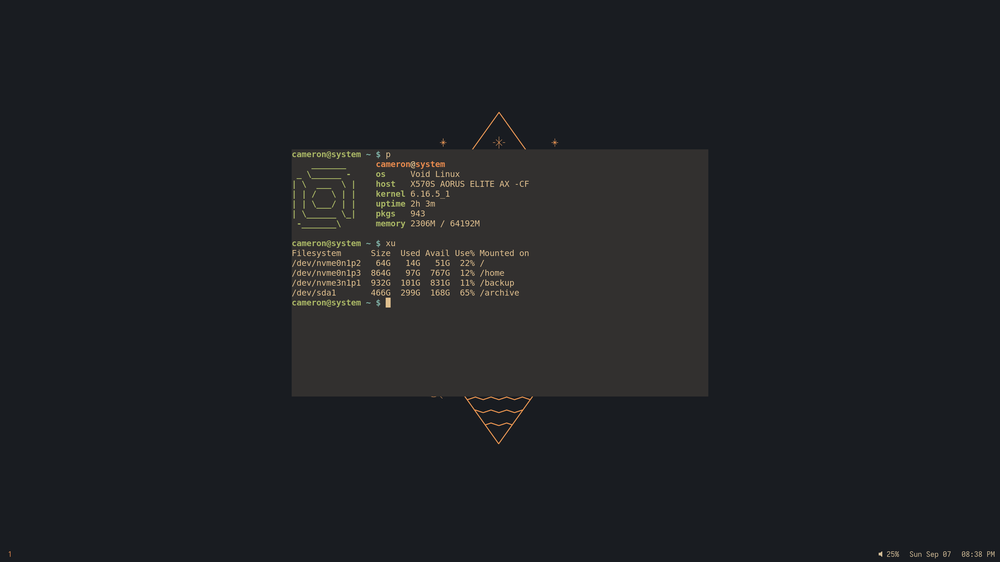

# Void



## Hardware

### Desktop

* Ryzen 9 5900x
* PowerColor 6650 XT
* Aorus x570s Elite AX ([settings](#bios))
* 2 x 32 GB ECC (https://www.kingston.com/dataSheets/KSM32ED8_32ME.pdf)
* 3 x Samsung 970 Evo Plus

<!-- https://cultists.network/140/psu-tier-list/ -->

<!-- https://serverpartdeals.com/collections/hard-drives -->

<details>
<summary>Firmware</summary>

#### Keys

* `F12`: Boot menu
* `Delete`: BIOS

#### Update

[Download](https://www.gigabyte.com/Motherboard/X570S-AORUS-ELITE-AX-rev-1x/support#support-dl-bios)

#### Settings

* Tweaker -> Advanced CPU Settings -> SVM Mode: Enabled
* Settings -> Miscellaneous -> LEDs in System Power On State: Off
* Boot -> Full Screen LOGO Show: Disabled
* Boot -> Fast Boot: Disabled
* Boot -> CSM Support: Disabled
* Boot -> Secure Boot -> Secure Boot: Disabled
* Boot -> Preferred Operating Mode: Advanced Mode
* Smart Fan 6 (F6): 30:*20C*, 32:*30C*, 34:*40C*, 36:*50C*, 38:*60C*, 40:*70C*, 80:*85C*
* Favorites (F11): Press 'Insert' key until favorite list has been cleared

Make sure to use step instead of gradual when adjusting the fan curve.
That way the fan only kicks in at 85C.

Note: The only way to make persistent changes to the fan curve is by dragging with the mouse.
Manually entering numbers into the text boxes below does not work.

#### Memory

```
dmidecode -t memory | grep "Total Width"
```

`72 bits` means ECC is working.

<!-- dmesg | grep EDAC -->

#### Test

https://www.mersenne.org/download/

</details>

### Laptop

* HP Dev One
* Intel AX200 Wi-Fi 6
* Samsung 990 Evo

<details>
<summary>Firmware</summary>

#### Keys

* `F9`: Boot menu
* `F10`: BIOS
* `Escape`: Both

#### Update

```
xbps-install -yu fwupd
fwupdtool refresh
fwupdtool get-updates
fwupdtool update
```

#### Settings

* TPM State: Disabled
* Virtualization Technology: Enabled
* Adaptive Battery Optimizer: Enabled
* Keyboard Backlight Timeout: Never
* Network Boot: Disabled
* Secure Boot: Disabled

</details>

### Peripherals

* Razer Naga Chroma
* [8BitDo Pro 2](https://www.8bitdo.com/pro2/)

## Download

```
git clone https://github.com/camj2/void
cd void
```

## Install

```
install.txt
```

Note: You could omit encryption for the desktop since it may not be necessary.

### Extend

If you ever need more space, extend the xfs volume with:

```
lvextend -L +16G system/home
xfs_growfs /home
```

## Post

<!-- https://github.com/swaywm/sway/wiki/VRR-setups -->

<!-- https://github.com/Alexays/Waybar/issues/1351#issuecomment-1001559391 -->

<!-- <details>
<summary>More</summary>

Keep the following directories synced together when using multiple `/` datasets:

```
/etc/ssh
/etc/wireguard
/var/lib/bluetooth
/var/lib/iwd
```

</details> -->

### Desktop

Set static ip address in router interface.

### Laptop

<!-- wpctl set-mute @DEFAULT_AUDIO_SOURCE@ 1 -->

Uncomment any laptop related keybindings:

```
~/.config/sway/config
```

Bump up the font size:

```
~/.config/alacritty/alacritty.toml : 16
~/.config/waybar/config            : 40 # height
~/.config/waybar/style.css         : 18
~/.config/waybar/style.css         : margin: 0 5px; # spacing

about:config                       : layout.css.devPixelsPerPx = 1.25 # firefox
```

Or, bump up the scale instead (not recommended):

```
output eDP-1 scale 1.25
```

Note: Many applications can be zoomed in using `CTRL +`

### Packages

Install the following additional packages:

```
xbps-restricted spotify
xbps-restricted msttcorefonts # laptop

xbps-install -yu spotify-adblock
xbps-install -yu razergenie # desktop
```

[ungoogled-chromium](https://github.com/DAINRA/ungoogled-chromium-void)

### Firefox

<!-- https://www.torproject.org/download/ -->

#### firefox-overlay

```
git clone https://gitlab.com/camj/firefox-overlay
cd firefox-overlay
make
make install
```

#### Config

`about:config`:

```
browser.sessionstore.resume_from_crash = false
browser.tabs.tabmanager.enabled = false

gfx.webrender.all = true
media.ffmpeg.vaapi.enabled = true

mousewheel.default.delta_multiplier_y = 80

privacy.firstparty.isolate = true

toolkit.legacyUserProfileCustomizations.stylesheets = true
toolkit.tabbox.switchByScrolling = true

network.dnsCacheEntries = 0
network.dnsCacheExpiration = 0
network.dnsCacheExpirationGracePeriod = 0
```

`~/.mozilla/firefox/<profile>/chrome/userChrome.css`:

```
* {
  border-radius: 0 !important;
}

.tabbrowser-tab .tab-close-button {
  visibility: collapse !important;
}

.titlebar-buttonbox-container {
  display: none !important;
}

.titlebar-spacer[type="pre-tabs"] {
  display: none !important;
}

.titlebar-spacer[type="post-tabs"] {
  display: none !important;
}

#alltabs-button {
  display: none !important;
}

:root[customtitlebar] .browser-titlebar {
  will-change: unset !important;
  transition: none !important;

  &:-moz-window-inactive {
    opacity: 1 !important;
  }
}
```

Note: Use `CTRL + W` or the mouse scroll wheel to close tabs

#### Extensions

<!-- * CanvasBlocker -->
<!-- * LocalCDN -->
* ClearURLs
* Dark Reader (Toggle: `Alt + Shift + A`)
* I don't care about cookies
* Privacy Badger
* Return YouTube Dislike
* SponsorBlock for YouTube - Skip Sponsorships
* h264ify
* uBlock Origin
<!-- * Reddit Chat Shredder -->

#### uBlock Origin

Google:

<!-- https://www.reddit.com/r/uBlockOrigin/comments/1ct5mpt/heres_how_to_disable_googles_new_forced_ai/ -->

```
google.com##.hdzaWe
```

Agar.io:

<!-- https://www.reddit.com/r/Agario/comments/1b507nj/this_is_how_you_remove_the_black_bar_from_agario/ -->

```
agar.io##[id^="agar-io_"]
agar.io##html:style(--bottom-banner-height: 0 !important;)
```

### Thunar

Add the following bookmarks:

```
/home/cameron/Documents (Documents)
/home/cameron/Downloads (Downloads)
/home/cameron/Music     (Music)
/home/cameron/Pictures  (Pictures)
/home/cameron/Videos    (Videos)
/storage                (Storage)
/tmp                    (Temp)
```

### Theme

https://github.com/sainnhe/gruvbox-material

#### GTK

https://github.com/TheGreatMcPain/gruvbox-material-gtk

<!-- https://github.com/sainnhe/capitaine-cursors -->

```
gsettings set org.gnome.desktop.interface gtk-theme Gruvbox-Material-Dark
gsettings set org.gnome.desktop.interface icon-theme Gruvbox-Material-Dark

gsettings set org.gnome.desktop.interface cursor-theme Adwaita

gsettings set org.gnome.desktop.privacy remember-recent-files false

gsettings set org.gnome.calculator refresh-interval 0
```

#### Apps

<!-- xdg-mime query filetype <file> -->

```
xdg-settings set default-web-browser firefox.desktop
xdg-mime default firefox.desktop application/pdf

xdg-mime default code-oss.desktop text/plain

xdg-mime default vlc.desktop video/mp4
xdg-mime default vlc.desktop video/x-matroska

xdg-mime default vlc.desktop video/webm
xdg-mime default vlc.desktop video/quicktime

xdg-mime default vlc.desktop audio/mpeg
xdg-mime default vlc.desktop audio/x-wav

xdg-mime default feh.desktop image/png
xdg-mime default feh.desktop image/jpeg

xdg-mime default org.gnome.eog.desktop image/gif
xdg-mime default org.gnome.eog.desktop image/webp
```

### WI-FI

<!-- iw dev wlan0 get power_save -->

`/var/lib/iwd/<ssid>.psk`:

```
[Security]
Passphrase=<password>
```

<details>
<summary>Manual</summary>

```
[Security]
Passphrase=<password>

[Settings]
AutoConnect=false
```

</details>

#### Key

You can generate the preshared key with `wpa_passphrase`:

```
[Security]
PreSharedKey=<key>
```

### Wireguard

`/etc/wireguard/wg0.conf`

#### DNS

`/etc/resolv.conf`

### Bluetooth

https://wiki.archlinux.org/title/Bluetooth

```
scan on
devices
pair <dev>
trust <dev>
connect <dev>
scan off
```

### Printer

https://wiki.archlinux.org/title/CUPS

https://wiki.archlinux.org/title/SANE

https://www.pwg.org/printers/

#### Install

Main:

```
xbps-install -yu \
  cups \
  cups-filters \
  system-config-printer \
  simple-scan
```

Drivers:

```
xbps-install -yu \
  brother-brlaser \
  cnijfilter2 \
  epson-inkjet-printer-escpr \
  foomatic-db \
  foomatic-db-nonfree \
  gutenprint \
  hplip

# install one, or all; not required if printer supports ipp-everywhere
```

User:

```
usermod -a -G lpadmin <user>
```

#### Config

`/etc/cups/cupsd.conf`:

```
LogLevel none
PreserveJobFiles No
PreserveJobHistory No
```

<!-- cancel -a -x -->

`/etc/hosts`:

```
<ip_address> printer
```

Enable:

```
ln -s /etc/sv/cupsd /var/service/
```

#### Usage

http://localhost:631

```
system-config-printer
```

<details>
<summary>More</summary>

#### Firewall

Flush the ruleset if printer network discovery is not working:

```
nft flush ruleset
```

#### Brother MFC-7860DW

http://localhost:631 -> Administration -> Add Printer -> LPD/LPR Host or Printer -> `lpd://printer/queue` -> Brother -> Brother MFC-7365DN

```
xbps-install -yu brother-brscan4

brsaneconfig4 -a name=Brother model=MFC-7860DW nodename=printer
```

### Rust

```
curl --proto '=https' --tlsv1.2 -sSf https://sh.rustup.rs | sh
```

https://github.com/camj2/written

### Trezor

```
curl -s -o /etc/udev/rules.d/51-trezor.rules https://data.trezor.io/udev/51-trezor.rules
```

### Speedtest

https://www.speedtest.net/apps/cli

<!-- ### MP3Gain

https://sourceforge.net/projects/mp3gain/ -->

</details>

## LICENSE

MIT
